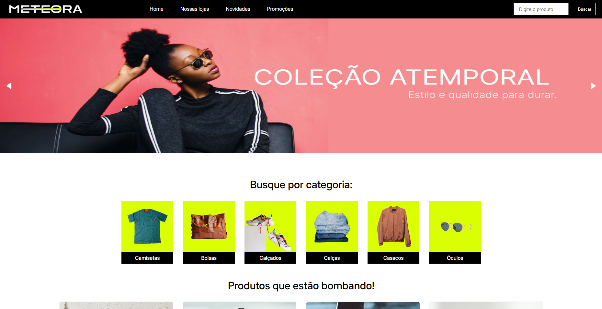
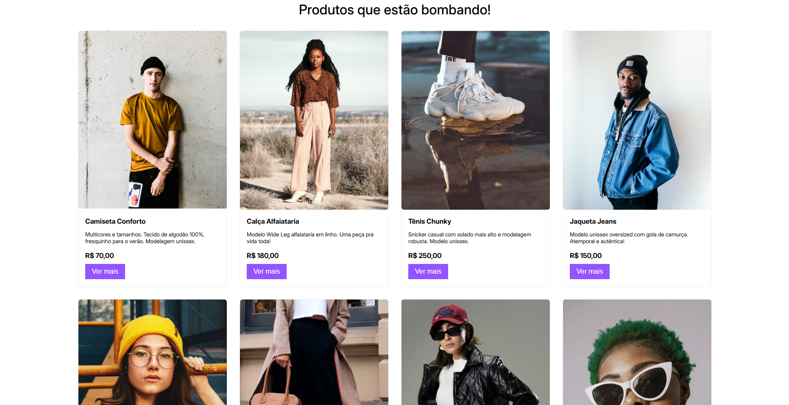
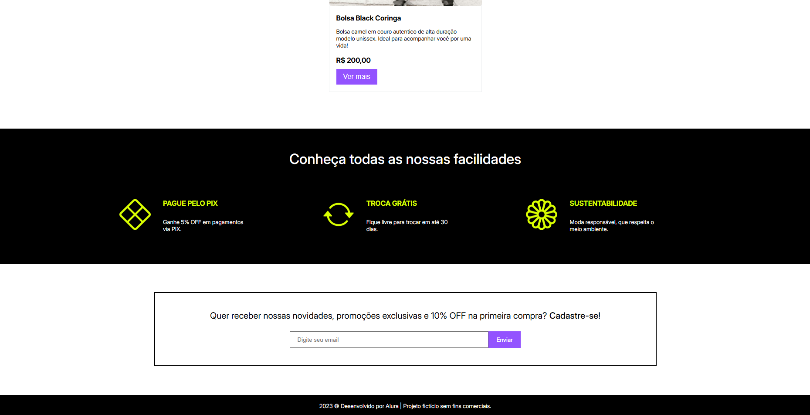
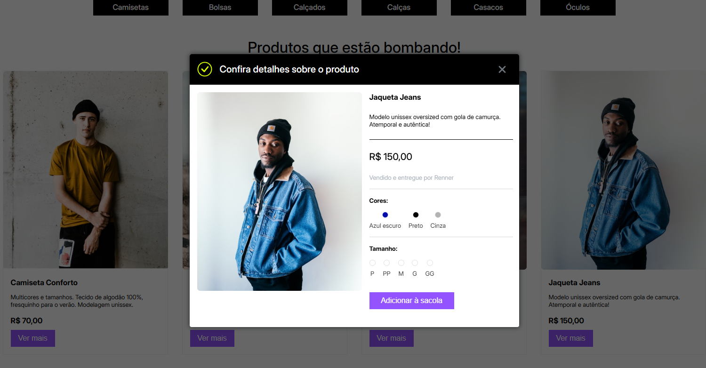
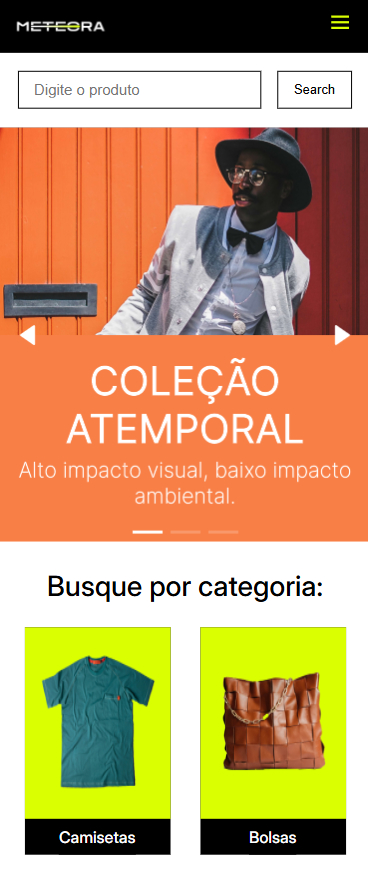
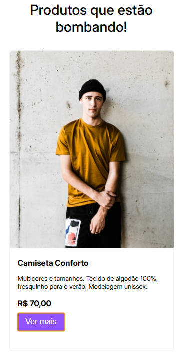
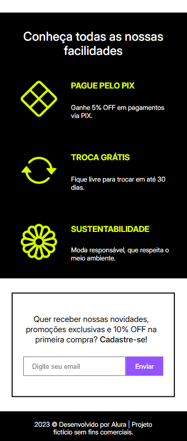
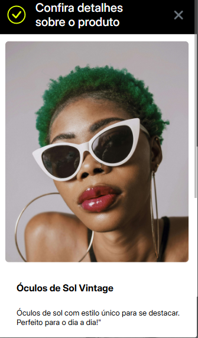
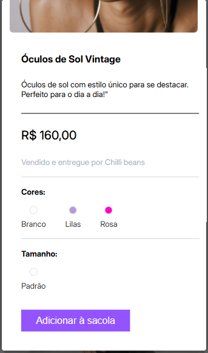

# 🛍️ Loja Meteora

Loja Meteora é uma aplicação front-end (SPA) de uma loja virtual de roupas e acessórios. O projeto foi desenvolvido como conclusão de formação. Ele se trata de um challenge da **Alura** e traz funcionalidades completas para visualização, busca e filtragem de produtos.

## ✨ Funcionalidades

- Listagem dinâmica de produtos via JSON
- Barra de busca de produtos
- Filtro por tipo de produto (camisetas, calças, óculos, bolsas, etc.)
- Modal com mais informações do produto (tamanho, cor, descrição e preço)
- Responsividade para diferentes tamanhos de tela (desktop, tablet e celular)

## 🚀 Tecnologias utilizadas

- 
- 
- 
- [SwiperJS](https://swiperjs.com/) (para o carrossel de imagens)

## 📦 Como rodar o projeto

Pré-requisitos

NodeJS
Git
Json-server

1. Clone o repositório:
   ```bash
   git clone https://github.com/Cassio1090/loja-meteora.git
   ```

2.Acesse a pasta do projeto:

`cd loja-meteora`

3.Instale o json-server globalmente (caso ainda não tenha):

`npm install -g json-server`

4.Inicie o json-server com o arquivo de dados na pasta backend

`json-server --watch produtos.json --port 3000`

5.Abra o arquivo index.html no seu navegador ou utilize uma extensão como Live Server (no VS Code).

## 📌 Status do projeto

🚧 Em desenvolvimento — Funcionalidades principais do desafio da Alura estão completas. Algumas melhorias e features adicionais ainda serão implementadas.

## 👨‍💻 Autor

Desenvolvido por Cássio C. Camargo 💻

## 🖼️ Prints

  
 

### Mobile
 
 



